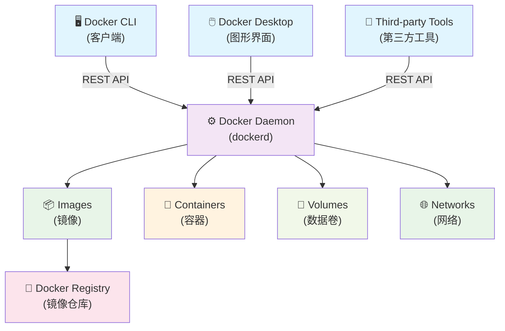

# 🐳 Docker 简介

> 深入了解 Docker 容器技术的核心概念、架构设计和技术优势

## 📋 本章学习目标

- 理解传统基础设施面临的挑战和问题
- 掌握 Docker 技术的核心优势和应用场景
- 深入了解 Docker 架构和核心组件
- 熟悉 Docker 生态系统的基本术语

---

## 1. 🏗️ 传统基础设施面临的挑战

### 1.1 环境一致性问题

- **"在我机器上能运行"综合症**：开发、测试、生产环境差异导致的部署问题
- **依赖管理复杂**：不同应用需要不同版本的运行时、库和系统配置
- **环境配置漂移**：手动配置导致的环境不一致性
- **版本冲突**：多个应用共享系统资源时的依赖版本冲突

### 1.2 资源利用率低

- **虚拟机开销大**：每个 VM 需要完整的操作系统，资源消耗高
- **硬件资源浪费**：静态资源分配导致的资源闲置
- **启动时间长**：虚拟机启动需要几分钟时间
- **管理复杂**：需要维护多个完整的操作系统

### 1.3 部署和扩展困难

- **部署流程复杂**：需要手动配置服务器环境
- **扩展性差**：难以快速响应负载变化
- **回滚困难**：版本回退复杂且风险高
- **环境重现困难**：生产问题难以在开发环境中重现

---

## 2. 🚀 为什么选择 Docker？

### 2.1 解决核心痛点

1. **环境标准化**："Build once, run anywhere" - 一次构建，到处运行
2. **轻量级虚拟化**：共享主机内核，资源消耗极低
3. **快速部署**：秒级启动，支持快速扩缩容
4. **版本控制**：镜像分层存储，支持版本管理和回滚

### 2.2 Docker 技术优势对比

| 特性 | 传统虚拟机 | Docker 容器 | 优势说明 |
|------|------------|-------------|----------|
| 启动时间 | 分钟级 | 秒级 | 快速响应业务需求 |
| 资源消耗 | 高（完整OS） | 低（共享内核） | 提高硬件利用率 |
| 隔离级别 | 硬件级隔离 | 进程级隔离 | 平衡安全性和性能 |
| 可移植性 | 差 | 优秀 | 跨平台部署无障碍 |
| 管理复杂度 | 高 | 低 | 简化运维工作 |
| 镜像大小 | GB级别 | MB级别 | 节省存储和传输成本 |
| 部署密度 | 低 | 高 | 单机运行更多应用 |

### 2.3 Docker 的核心优势

**🔄 一致性保证：**

- 开发环境一致性：消除"在我机器上能运行"的问题
- 部署环境标准化：确保开发、测试、生产环境完全一致
- 依赖管理简化：将应用及其依赖打包在一起

**⚡ 高效资源利用：**

- 轻量级：容器共享主机内核，开销极小
- 快速启动：秒级启动时间，支持快速扩缩容
- 高密度部署：单台主机可运行更多应用实例

**🚀 敏捷开发部署：**

- CI/CD 友好：完美集成持续集成和持续部署流程
- 微服务架构：天然支持微服务的独立部署和扩展
- 版本控制：镜像版本化管理，支持快速回滚

**🌐 跨平台兼容：**

- 平台无关：支持 Linux、Windows、macOS
- 云原生：完美适配各大云平台
- 混合云部署：支持本地和云端的无缝迁移

---

## 3. 🏛️ Docker 架构深度解析

### 3.1 核心组件架构图



### 3.2 🔧 Docker Daemon (守护进程)

**功能职责：**

- 监听 Docker API 请求
- 管理 Docker 对象（镜像、容器、网络、数据卷）
- 与其他 Docker 守护进程通信
- 处理镜像构建和容器运行

**运行模式：**

- 作为系统服务在后台运行
- 通过 Unix socket 或网络接口提供 API
- 支持集群模式（Docker Swarm）

### 3.3 💻 Docker Client (客户端)

**主要特点：**

- 用户与 Docker 交互的主要方式
- 通过 REST API 与 Docker Daemon 通信
- 支持本地和远程 Docker 主机连接

**常用客户端：**

- `docker` CLI 命令行工具
- Docker Desktop 图形界面
- 第三方管理工具（Portainer、Rancher 等）

### 3.4 📦 Docker Images (镜像)

**核心概念：**

- **只读模板**：用于创建 Docker 容器
- **分层存储**：采用 Union FS 技术，支持增量更新
- **版本管理**：通过标签（tag）管理不同版本

**镜像分层结构：**

```text
┌─────────────────┐ ← 应用层 (可写)
├─────────────────┤ ← 应用代码层
├─────────────────┤ ← 依赖库层
├─────────────────┤ ← 运行时层
└─────────────────┘ ← 基础系统层
```

**镜像命名规范：**

```text
[registry]/[namespace]/[repository]:[tag]

示例：
- nginx:latest                    # 官方镜像
- mysql:8.0                       # 官方镜像带版本
- stacksimplify/app:1.0.0         # 用户镜像
- registry.example.com/app:v1.0   # 私有仓库镜像
```

### 3.5 🏃 Docker Containers (容器)

**定义：**

- 镜像的运行实例
- 包含应用程序及其所有依赖
- 提供隔离的运行环境

**容器生命周期：**

1. **Created** - 已创建但未启动
2. **Running** - 正在运行
3. **Paused** - 已暂停
4. **Stopped** - 已停止
5. **Deleted** - 已删除

**容器特性：**

- 进程级隔离：每个容器运行在独立的进程空间
- 资源限制：可以限制 CPU、内存、网络等资源使用
- 文件系统隔离：容器有自己的文件系统视图
- 网络隔离：容器可以有独立的网络配置

### 3.6 🏪 Docker Registry (镜像仓库)

**Docker Hub（官方仓库）：**

- 全球最大的容器镜像仓库
- 提供官方和社区镜像
- 支持公有和私有仓库
- 地址：<https://hub.docker.com/>

**私有仓库选项：**

- Docker Registry（开源）
- Harbor（企业级）
- AWS ECR、Azure ACR、Google GCR
- 阿里云、腾讯云等国内云服务商

### 3.7 🔗 Docker Networks (网络)

**网络类型：**

- **bridge**：默认网络模式，容器间可通信
- **host**：容器使用主机网络
- **none**：容器无网络连接
- **overlay**：跨主机容器通信（Swarm 模式）

### 3.8 💾 Docker Volumes (数据卷)

**数据持久化方案：**

- **Volumes**：Docker 管理的数据卷
- **Bind mounts**：绑定主机目录
- **tmpfs mounts**：内存文件系统（临时）

---

## 4. 📋 核心概念总结

- **Docker Images (镜像)**：只读模板，采用分层存储，用于创建容器
- **Docker Containers (容器)**：镜像的运行实例，提供隔离的应用运行环境
- **Dockerfile**：构建镜像的指令文件，定义镜像构建步骤
- **Docker Registry**：镜像仓库，存储和分发 Docker 镜像
- **Docker Daemon**：Docker 守护进程，管理所有 Docker 对象
- **Docker Client**：用户与 Docker 交互的客户端工具

---

## 5. 💡 实践建议

1. **理解容器 vs 虚拟机**：重点掌握两者的区别和适用场景
2. **熟悉架构组件**：了解各组件的职责和交互方式
3. **掌握核心术语**：为后续学习打好基础
4. **动手实践**：通过实际操作加深理解

---

## 6. 🔗 深入学习资源

### 6.1 官方文档

- [Docker 官方文档](https://docs.docker.com/)
- [Docker Hub](https://hub.docker.com/)
- [Docker 架构概述](https://docs.docker.com/get-started/overview/)

### 6.2 实践建议

- 先理解概念，再动手实践
- 重点关注 Docker 与传统虚拟化的区别
- 熟悉 Docker 生态系统的各个组件

### 6.3 演示资料

- 📊 [Docker 架构图解](../PPT/Docker%20动手教程/)
- 🎯 实践练习将在后续章节中提供

---

## 📝 本章小结

通过本章学习，您应该已经：

✅ 理解了传统基础设施的挑战和 Docker 的解决方案  
✅ 掌握了 Docker 的核心优势和技术特点  
✅ 熟悉了 Docker 架构的各个组件及其作用  
✅ 了解了 Docker 生态系统的基本概念  

**下一步：** 继续学习 [Docker 安装与配置](../02-Docker-Installation/) 章节，开始实际操作 Docker。
