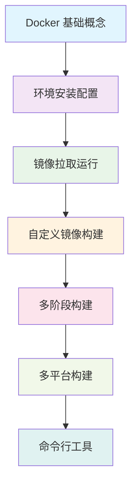

# 🛠️ Docker 安装与配置

> 在不同操作系统上安装和配置 Docker 环境的完整指南

## 🗺️ 学习路径指引

在开始安装 Docker 之前，让我们先了解整个学习路径，这将帮助您更好地规划学习进度：



### 📚 学习建议

- **当前阶段**：环境安装配置（第2章）
- **预计时间**：30-60分钟
- **前置知识**：已完成第1章基础概念学习
- **下一步**：第3章镜像拉取和运行

> 💡 **提示**：安装完成后，建议立即进行基础验证，确保环境正常工作后再进入下一章学习。

## 📋 本章学习目标

- 掌握在不同操作系统上安装 Docker 的方法
- 了解 Docker Desktop 和 Docker Engine 的区别
- 学会验证 Docker 安装是否成功
- 掌握常见安装问题的解决方案
- 配置 Docker 的基本设置和优化

## 🖥️ 系统要求

### macOS 系统要求

- **操作系统**：macOS 10.15 或更高版本
- **硬件**：2010 年或更新的 Mac，支持 Intel 或 Apple Silicon
- **内存**：至少 4GB RAM
- **磁盘空间**：至少 2.5GB 可用空间

### Windows 系统要求

- **操作系统**：Windows 10 64-bit Pro, Enterprise, Education (Build 19041 或更高)
- **功能**：启用 Hyper-V 和容器 Windows 功能
- **硬件**：支持 SLAT 的 64 位处理器
- **内存**：至少 4GB RAM
- **BIOS**：启用虚拟化支持

### Linux 系统要求

- **内核版本**：3.10 或更高
- **架构**：x86_64, armhf, arm64, s390x
- **存储驱动**：支持 overlay2, aufs, btrfs, zfs, devicemapper

## 🍎 macOS 安装指南

### 方法一：Docker Desktop（推荐）

1. **下载 Docker Desktop**
   - 访问 [Docker Desktop for Mac](https://docs.docker.com/docker-for-mac/install/)
   - 根据芯片类型选择对应版本：
     - Intel 芯片：Docker Desktop for Mac with Intel chip
     - Apple Silicon：Docker Desktop for Mac with Apple chip

2. **安装步骤**

   ```bash
   # 下载后双击 Docker.dmg 文件
   # 将 Docker 拖拽到 Applications 文件夹
   # 启动 Docker Desktop
   ```

3. **验证安装**

   ```bash
   # 检查 Docker 版本
   docker --version
   
   # 检查 Docker Compose 版本
   docker-compose --version
   
   # 运行测试容器
   docker run hello-world
   ```

### 方法二：Homebrew 安装

```bash
# 安装 Homebrew（如果未安装）
/bin/bash -c "$(curl -fsSL https://raw.githubusercontent.com/Homebrew/install/HEAD/install.sh)"

# 安装 Docker Desktop
brew install --cask docker

# 启动 Docker Desktop
open /Applications/Docker.app
```

## 🪟 Windows 安装指南

### 前置条件检查

1. **启用 WSL 2**

   ```powershell
   # 以管理员身份运行 PowerShell
   dism.exe /online /enable-feature /featurename:Microsoft-Windows-Subsystem-Linux /all /norestart
   dism.exe /online /enable-feature /featurename:VirtualMachinePlatform /all /norestart
   
   # 重启计算机
   # 下载并安装 WSL2 Linux 内核更新包
   # 设置 WSL 2 为默认版本
   wsl --set-default-version 2
   ```

2. **启用 Hyper-V**（Windows Pro/Enterprise）

   ```powershell
   # 启用 Hyper-V
   Enable-WindowsOptionalFeature -Online -FeatureName Microsoft-Hyper-V -All
   ```

### Docker Desktop 安装

1. **下载安装包**
   - 访问 [Docker Desktop for Windows](https://docs.docker.com/docker-for-windows/install/)
   - 下载 Docker Desktop Installer.exe

2. **安装配置**

   ```bash
   # 运行安装程序，选择以下配置：
   # ✅ Enable Hyper-V Windows Features
   # ✅ Install required Windows components for WSL 2
   # ✅ Add shortcut to desktop
   ```

3. **验证安装**

   ```cmd
   docker --version
   docker run hello-world
   ```

## 🐧 Linux 安装指南

### Ubuntu/Debian 安装

```bash
# 更新包索引
sudo apt-get update

# 安装必要的包
sudo apt-get install \
    ca-certificates \
    curl \
    gnupg \
    lsb-release

# 添加 Docker 官方 GPG 密钥
sudo mkdir -p /etc/apt/keyrings
curl -fsSL https://download.docker.com/linux/ubuntu/gpg | sudo gpg --dearmor -o /etc/apt/keyrings/docker.gpg

# 设置稳定版仓库
echo \
  "deb [arch=$(dpkg --print-architecture) signed-by=/etc/apt/keyrings/docker.gpg] https://download.docker.com/linux/ubuntu \
  $(lsb_release -cs) stable" | sudo tee /etc/apt/sources.list.d/docker.list > /dev/null

# 安装 Docker Engine
sudo apt-get update
sudo apt-get install docker-ce docker-ce-cli containerd.io docker-compose-plugin

# 启动 Docker 服务
sudo systemctl start docker
sudo systemctl enable docker

# 将用户添加到 docker 组（避免使用 sudo）
sudo usermod -aG docker $USER

# 重新登录或运行以下命令使组变更生效
newgrp docker
```

### CentOS/RHEL 安装

```bash
# 安装 yum-utils
sudo yum install -y yum-utils

# 添加 Docker 仓库
sudo yum-config-manager \
    --add-repo \
    https://download.docker.com/linux/centos/docker-ce.repo

# 安装 Docker Engine
sudo yum install docker-ce docker-ce-cli containerd.io docker-compose-plugin

# 启动 Docker
sudo systemctl start docker
sudo systemctl enable docker

# 验证安装
sudo docker run hello-world
```

## ✅ 安装验证

### 基本验证命令

```bash
# 1. 检查 Docker 版本信息
docker version

# 2. 查看 Docker 系统信息
docker info

# 3. 运行测试容器
docker run hello-world

# 4. 检查 Docker Compose
docker compose version

# 5. 列出 Docker 镜像
docker images

# 6. 列出运行中的容器
docker ps
```

### 预期输出示例

```bash
$ docker --version
Docker version 24.0.6, build ed223bc

$ docker run hello-world
Hello from Docker!
This message shows that your installation appears to be working correctly.
```

## 🔧 Docker 配置优化

### 配置文件位置

- **macOS**: `~/.docker/daemon.json`
- **Windows**: `C:\Users\<username>\.docker\daemon.json`
- **Linux**: `/etc/docker/daemon.json`

### 推荐配置

```json
{
  "registry-mirrors": [
    "https://docker.mirrors.ustc.edu.cn",
    "https://hub-mirror.c.163.com"
  ],
  "log-driver": "json-file",
  "log-opts": {
    "max-size": "10m",
    "max-file": "3"
  },
  "storage-driver": "overlay2",
  "experimental": false
}
```

### 应用配置

```bash
# 重启 Docker 服务使配置生效
# Linux
sudo systemctl restart docker

# macOS/Windows
# 重启 Docker Desktop
```

## 🚨 常见问题解决

### macOS 问题

#### 问题 1：Docker Desktop 与 osxkeychain 冲突

**错误信息：**

```text
Error saving credentials: error storing credentials - err: exit status 1, out: `The user name or passphrase you entered is not correct.`
```

**解决方案：**

1. **清理钥匙串访问**

   ```bash
   # 打开钥匙串访问应用
   # 搜索 "docker" 或 "hub.docker.com"
   # 删除所有 Docker 相关条目
   ```

2. **重置 Docker 凭据**

   ```bash
   # 登出 Docker
   docker logout
   
   # 清理配置文件
   rm -rf ~/.docker/config.json
   
   # 重新登录
   docker login
   ```

3. **如果问题持续存在**

   ```bash
   # 完全重置 Docker Desktop
   # Docker Desktop > Settings > Troubleshoot > Clean / Purge data
   
   # 或者重新安装 Docker Desktop
   ```

#### 问题 2：Apple Silicon 兼容性

```bash
# 对于需要 x86 架构的镜像
docker run --platform linux/amd64 <image-name>

# 构建多架构镜像
docker buildx build --platform linux/amd64,linux/arm64 -t <image-name> .
```

### Windows 问题

#### 问题 1：WSL 2 相关错误

```powershell
# 更新 WSL 2
wsl --update

# 检查 WSL 版本
wsl --list --verbose

# 设置默认 WSL 版本
wsl --set-default-version 2
```

#### 问题 2：Hyper-V 冲突

```powershell
# 检查 Hyper-V 状态
Get-WindowsOptionalFeature -FeatureName Microsoft-Hyper-V-All -Online

# 启用 Hyper-V
Enable-WindowsOptionalFeature -Online -FeatureName Microsoft-Hyper-V -All
```

### Linux 问题

#### 问题 1：权限问题

```bash
# 将用户添加到 docker 组
sudo usermod -aG docker $USER

# 重新登录或运行
newgrp docker

# 验证权限
docker run hello-world
```

#### 问题 2：服务启动失败

```bash
# 检查服务状态
sudo systemctl status docker

# 查看日志
sudo journalctl -u docker.service

# 重启服务
sudo systemctl restart docker
```

## 🔍 Docker Desktop 功能介绍

### 主要功能

1. **图形化界面**：直观的容器和镜像管理
2. **资源监控**：CPU、内存、磁盘使用情况
3. **日志查看**：容器日志的实时查看
4. **网络管理**：Docker 网络的可视化管理
5. **卷管理**：数据卷的创建和管理
6. **扩展支持**：丰富的插件生态系统

### 推荐设置

```json
{
  "资源分配": {
    "CPUs": "建议分配 2-4 核心",
    "Memory": "建议分配 4-8GB",
    "Swap": "建议 1GB",
    "Disk": "建议 60GB+"
  },
  "功能开关": {
    "Enable Kubernetes": "根据需要开启",
    "Show system containers": "建议开启",
    "Send usage statistics": "可选"
  }
}
```

## 📚 学习资源

### 官方文档

- 📖 [Docker 安装文档](https://docs.docker.com/get-docker/)
- 🔧 [Docker Desktop 文档](https://docs.docker.com/desktop/)
- 🐧 [Linux 安装指南](https://docs.docker.com/engine/install/)

### 社区资源

- 💬 [Docker 官方论坛](https://forums.docker.com/)
- 📺 [Docker 官方 YouTube](https://www.youtube.com/user/dockerrun)
- 📱 [Docker 官方博客](https://www.docker.com/blog/)

## 🎯 本章小结

通过本章学习，您应该已经：

- ✅ 成功在您的操作系统上安装了 Docker
- ✅ 了解了不同平台的安装方法和注意事项
- ✅ 掌握了基本的验证和配置方法
- ✅ 学会了解决常见安装问题的方法
- ✅ 熟悉了 Docker Desktop 的基本功能

**下一步：** 继续学习 [从 Docker Hub 拉取和运行镜像](../03-Pull-from-DockerHub-and-Run-Docker-Images/) 章节，开始实际使用 Docker。
