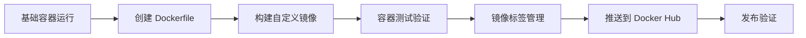

# 🏗️ 构建新的 Docker 镜像并推送到 Docker Hub

> 从零开始学习 Docker 镜像构建、自定义和发布的完整实战教程

## 🎯 本章学习目标

完成本章学习后，您将能够：

- ✅ **掌握 Dockerfile 编写**：理解语法、指令和最佳实践
- ✅ **构建自定义镜像**：从基础镜像创建个性化应用镜像
- ✅ **镜像标签管理**：学会版本控制和标签策略
- ✅ **发布到 Docker Hub**：完整的推送和分享流程
- ✅ **镜像优化技巧**：减小体积、提升安全性和性能
- ✅ **故障排除能力**：常见问题的诊断和解决方法

## ⏱️ 预计学习时间

- **理论学习**：30 分钟
- **实践操作**：60 分钟
- **总计时间**：90 分钟

## 📋 前置要求

- ✅ 已安装 Docker Desktop 或 Docker Engine
- ✅ 拥有 Docker Hub 账户（[免费注册](https://hub.docker.com/)）
- ✅ 基本的命令行操作能力
- ✅ 完成前面章节的学习

## 🎯 项目概述

本章将通过构建一个自定义 Nginx Web 应用，带您完整体验 Docker 镜像的创建、构建和发布流程。

### 📚 学习路径



### 🛠️ 实践步骤

| 步骤 | 内容 | 预计时间 | 难度 |
|------|------|----------|------|
| 1️⃣ | 🔧 运行基础 Nginx 容器 | 10 分钟 | ⭐ |
| 2️⃣ | 📝 创建 Dockerfile 和自定义内容 | 15 分钟 | ⭐⭐ |
| 3️⃣ | 🏗️ 构建自定义镜像 | 10 分钟 | ⭐⭐ |
| 4️⃣ | 🚀 运行和测试自定义容器 | 10 分钟 | ⭐ |
| 5️⃣ | 🏷️ 镜像标签管理 | 10 分钟 | ⭐⭐ |
| 6️⃣ | ☁️ 推送镜像到 Docker Hub | 15 分钟 | ⭐⭐⭐ |
| 7️⃣ | ✅ 验证镜像发布成功 | 10 分钟 | ⭐ |

### 🎁 最终成果

完成本章后，您将拥有：

- 🌐 一个自定义的 Web 应用镜像
- 📦 发布在 Docker Hub 上的公开镜像
- 🔧 完整的镜像构建和发布技能
- 📚 可复用的 Dockerfile 模板

## 🔧 步骤 1：运行基础 Nginx 容器

### 🎯 目标

了解官方 Nginx 镜像的默认行为，为后续自定义做准备。

### 🚀 启动基础容器

```bash
# 拉取并运行官方 Nginx 容器
docker run --name mynginx1 -p 80:80 -d nginx

# 验证容器运行状态
docker ps

# 查看容器详细信息
docker inspect mynginx1

# 测试默认页面
curl http://localhost

# 或在浏览器中访问 http://localhost
```

### 📊 命令解析

| 参数 | 说明 |
|------|------|
| `--name mynginx1` | 为容器指定名称，便于管理 |
| `-p 80:80` | 端口映射：主机80端口 → 容器80端口 |
| `-d` | 后台运行模式（detached） |
| `nginx` | 使用官方 Nginx 镜像 |

### 📋 预期输出

```bash
$ docker run --name mynginx1 -p 80:80 -d nginx
Unable to find image 'nginx:latest' locally
latest: Pulling from library/nginx
a2abf6c4d29d: Pull complete
a9edb18cadd1: Pull complete
589b7251471a: Pull complete
...
Status: Downloaded newer image for nginx:latest
7a8c9b2d3e4f5a6b7c8d9e0f1a2b3c4d5e6f7a8b9c0d1e2f3a4b5c6d7e8f9a0b

$ docker ps
CONTAINER ID   IMAGE     COMMAND                  CREATED         STATUS         PORTS                NAMES
7a8c9b2d3e4f   nginx     "/docker-entrypoint.…"   2 minutes ago   Up 2 minutes   0.0.0.0:80->80/tcp   mynginx1

$ curl http://localhost
<!DOCTYPE html>
<html>
<head>
<title>Welcome to nginx!</title>
<style>
    body { width: 35em; margin: 0 auto; font-family: Tahoma, Verdana, Arial, sans-serif; }
</style>
</head>
<body>
<h1>Welcome to nginx!</h1>
<p>If you see this page, the nginx web server is successfully installed and working.</p>
<p>For online documentation and support please refer to <a href="http://nginx.org/">nginx.org</a>.</p>
<p><em>Thank you for using nginx.</em></p>
</body>
</html>
```

### ✅ 验证检查点

- [ ] 容器成功启动并运行
- [ ] 端口映射正常工作
- [ ] 可以访问默认 Nginx 页面
- [ ] 容器状态显示为 "Up"

### 🔍 探索容器内部

了解 Nginx 容器的内部结构，为自定义做准备。

```bash
# 进入容器查看默认配置
docker exec -it mynginx1 /bin/bash

# 在容器内部执行以下命令：

# 1. 查看网站文件目录
ls -la /usr/share/nginx/html/
# 输出：index.html  50x.html

# 2. 查看默认首页内容
cat /usr/share/nginx/html/index.html

# 3. 查看 Nginx 主配置文件
cat /etc/nginx/nginx.conf

# 4. 查看默认站点配置
cat /etc/nginx/conf.d/default.conf

# 5. 查看 Nginx 进程
ps aux | grep nginx

# 6. 查看监听端口
netstat -tlnp

# 退出容器
exit
```

### 📝 关键发现

| 路径 | 用途 | 说明 |
|------|------|------|
| `/usr/share/nginx/html/` | 网站根目录 | 存放 HTML 文件的地方 |
| `/etc/nginx/nginx.conf` | 主配置文件 | Nginx 全局配置 |
| `/etc/nginx/conf.d/` | 站点配置目录 | 虚拟主机配置 |
| `/var/log/nginx/` | 日志目录 | 访问和错误日志 |

### 🧹 清理测试环境

```bash
# 停止容器
docker stop mynginx1

# 删除容器
docker rm mynginx1

# 验证清理结果
docker ps -a | grep mynginx1
# 应该没有输出，表示容器已删除
```

## 📝 步骤 2：创建 Dockerfile 和自定义内容

### 🎯 目标

创建一个包含自定义网页和 Dockerfile 的项目，准备构建个性化镜像。

### 📁 创建项目目录

```bash
# 创建项目目录
mkdir my-nginx-app
cd my-nginx-app

# 查看当前目录
pwd
# 输出类似：/Users/username/my-nginx-app

# 初始化项目结构
mkdir -p assets/css assets/js
touch index.html Dockerfile .dockerignore

# 查看项目结构
tree . || ls -la
```

### 📋 项目结构规划

```text
my-nginx-app/
├── index.html          # 自定义首页
├── Dockerfile          # 镜像构建文件
├── .dockerignore       # 构建忽略文件
└── assets/             # 静态资源目录
    ├── css/            # 样式文件
    └── js/             # JavaScript 文件
```

### 🎨 创建自定义 HTML 文件

创建一个现代化的响应式网页 `index.html`：

```html
<!DOCTYPE html>
<html lang="zh-CN">
<head>
    <meta charset="UTF-8">
    <meta name="viewport" content="width=device-width, initial-scale=1.0">
    <title>我的 Docker 应用 | 自定义 Nginx 容器</title>
    <meta name="description" content="使用 Docker 构建的自定义 Nginx Web 应用">
    <style>
        * {
            margin: 0;
            padding: 0;
            box-sizing: border-box;
        }
        
        body {
            font-family: 'Segoe UI', Tahoma, Geneva, Verdana, sans-serif;
            background: linear-gradient(135deg, #667eea 0%, #764ba2 100%);
            min-height: 100vh;
            display: flex;
            justify-content: center;
            align-items: center;
            color: white;
            line-height: 1.6;
        }
        
        .container {
            text-align: center;
            background: rgba(255, 255, 255, 0.1);
            padding: 3rem 2rem;
            border-radius: 20px;
            backdrop-filter: blur(15px);
            box-shadow: 0 8px 32px 0 rgba(31, 38, 135, 0.37);
            border: 1px solid rgba(255, 255, 255, 0.18);
            max-width: 600px;
            width: 90%;
            animation: fadeInUp 1s ease-out;
        }
        
        @keyframes fadeInUp {
            from {
                opacity: 0;
                transform: translateY(30px);
            }
            to {
                opacity: 1;
                transform: translateY(0);
            }
        }
        
        .emoji {
            font-size: 4rem;
            margin-bottom: 1.5rem;
            animation: bounce 2s infinite;
        }
        
        @keyframes bounce {
            0%, 20%, 50%, 80%, 100% {
                transform: translateY(0);
            }
            40% {
                transform: translateY(-10px);
            }
            60% {
                transform: translateY(-5px);
            }
        }
        
        h1 {
            font-size: 2.5rem;
            margin-bottom: 1.5rem;
            text-shadow: 2px 2px 4px rgba(0,0,0,0.3);
            font-weight: 700;
        }
        
        .features {
            margin: 2rem 0;
        }
        
        .feature {
            font-size: 1.1rem;
            margin-bottom: 1rem;
            padding: 0.5rem;
            background: rgba(255, 255, 255, 0.1);
            border-radius: 10px;
            transition: transform 0.3s ease;
        }
        
        .feature:hover {
            transform: translateY(-2px);
        }
        
        .info-grid {
            display: grid;
            grid-template-columns: repeat(auto-fit, minmax(150px, 1fr));
            gap: 1rem;
            margin-top: 2rem;
        }
        
        .info-item {
            background: rgba(255, 255, 255, 0.1);
            padding: 1rem;
            border-radius: 10px;
            font-size: 0.9rem;
        }
        
        .info-item strong {
            display: block;
            margin-bottom: 0.5rem;
            color: #ffd700;
        }
        
        .footer {
            margin-top: 2rem;
            font-size: 0.8rem;
            opacity: 0.8;
        }
        
        @media (max-width: 768px) {
            .container {
                padding: 2rem 1rem;
            }
            
            h1 {
                font-size: 2rem;
            }
            
            .emoji {
                font-size: 3rem;
            }
        }
    </style>
</head>
<body>
    <div class="container">
        <div class="emoji">🐳</div>
        <h1>我的 Docker 应用</h1>
        
        <div class="features">
            <div class="feature">🚀 基于 Docker 容器技术构建</div>
            <div class="feature">📦 使用 Nginx 官方镜像</div>
            <div class="feature">🎯 展示镜像构建和部署流程</div>
            <div class="feature">🌐 支持响应式设计</div>
        </div>
        
        <div class="info-grid">
            <div class="info-item">
                <strong>版本</strong>
                v1.0.0
            </div>
            <div class="info-item">
                <strong>技术栈</strong>
                Docker + Nginx
            </div>
            <div class="info-item">
                <strong>状态</strong>
                ✅ 运行中
            </div>
            <div class="info-item">
                <strong>环境</strong>
                容器化部署
            </div>
        </div>
        
        <div class="footer">
            <p>🎓 Docker 学习实践项目</p>
            <p>构建时间: <span id="buildTime"></span></p>
        </div>
    </div>
    
    <script>
        // 显示当前时间作为构建时间
        document.getElementById('buildTime').textContent = new Date().toLocaleString('zh-CN');
        
        // 添加一些交互效果
        document.querySelectorAll('.feature').forEach(feature => {
            feature.addEventListener('click', function() {
                this.style.background = 'rgba(255, 255, 255, 0.2)';
                setTimeout(() => {
                    this.style.background = 'rgba(255, 255, 255, 0.1)';
                }, 200);
            });
        });
    </script>
</body>
</html>
```

### 创建 Dockerfile

创建 `Dockerfile` 文件：

```dockerfile
# 使用官方 Nginx 镜像作为基础镜像
FROM nginx:alpine

# 设置维护者信息
LABEL maintainer="your-email@example.com"
LABEL version="1.0.0"
LABEL description="自定义 Nginx Web 应用"

# 复制自定义 HTML 文件到 Nginx 默认目录
COPY index.html /usr/share/nginx/html/

# 可选：复制自定义 Nginx 配置（如果需要）
# COPY nginx.conf /etc/nginx/nginx.conf

# 暴露端口 80
EXPOSE 80

# 启动 Nginx（继承自基础镜像的 CMD）
# CMD ["nginx", "-g", "daemon off;"]
```

### 创建 .dockerignore 文件

创建 `.dockerignore` 文件以排除不需要的文件：

```text
# 排除不需要的文件和目录
.git
.gitignore
README.md
Dockerfile
.dockerignore
node_modules
*.log
.DS_Store
Thumbs.db
```

### 验证项目结构

```bash
# 查看项目文件结构
ls -la

# 预期输出：
# -rw-r--r--  1 user  staff   123 Oct  1 10:00 .dockerignore
# -rw-r--r--  1 user  staff   456 Oct  1 10:00 Dockerfile
# -rw-r--r--  1 user  staff  1234 Oct  1 10:00 index.html
```

## 🏗️ 步骤 3：构建 Docker 镜像

### 基本构建命令

```bash
# 构建镜像（请替换为您的 Docker Hub 用户名）
docker build -t <your-docker-hub-id>/mynginx:v1 .

# 示例（使用 stacksimplify 作为示例）
docker build -t stacksimplify/mynginx:v1 .

# 查看构建过程
docker build -t <your-docker-hub-id>/mynginx:v1 . --no-cache
```

### 构建过程详解

```bash
# 详细构建输出示例
$ docker build -t stacksimplify/mynginx:v1 .
[+] Building 2.3s (8/8) FINISHED
 => [internal] load build definition from Dockerfile                    0.0s
 => => transferring dockerfile: 456B                                    0.0s
 => [internal] load .dockerignore                                       0.0s
 => => transferring context: 123B                                       0.0s
 => [internal] load metadata for docker.io/library/nginx:alpine        1.2s
 => [internal] load build context                                       0.0s
 => => transferring context: 1.23kB                                     0.0s
 => [1/2] FROM docker.io/library/nginx:alpine@sha256:abc123...          0.0s
 => CACHED [2/2] COPY index.html /usr/share/nginx/html/                 0.0s
 => exporting to image                                                   0.1s
 => => exporting layers                                                  0.0s
 => => writing image sha256:def456...                                    0.0s
 => => naming to docker.io/stacksimplify/mynginx:v1                     0.0s
```

### 验证镜像构建

```bash
# 查看本地镜像
docker images

# 查看特定镜像
docker images stacksimplify/mynginx

# 查看镜像详细信息
docker image inspect stacksimplify/mynginx:v1

# 查看镜像构建历史
docker history stacksimplify/mynginx:v1
```

## 🚀 步骤 4：运行自定义容器

### 运行新构建的镜像

```bash
# 运行自定义镜像
docker run --name mynginx2 -p 80:80 -d stacksimplify/mynginx:v1

# 替换为您的 Docker Hub ID
docker run --name mynginx2 -p 80:80 -d <your-docker-hub-id>/mynginx:v1

# 验证容器运行状态
docker ps
```

### 测试自定义应用

```bash
# 使用 curl 测试
curl http://localhost

# 在浏览器中访问
# http://localhost

# 查看容器日志
docker logs mynginx2

# 查看容器资源使用
docker stats mynginx2 --no-stream
```

### 对比测试

```bash
# 同时运行官方镜像进行对比
docker run --name nginx-official -p 8080:80 -d nginx:alpine

# 对比两个页面
curl http://localhost      # 自定义镜像
curl http://localhost:8080 # 官方镜像

# 清理测试容器
docker stop nginx-official
docker rm nginx-official
```

## 🏷️ 步骤 5：镜像标签管理

### 理解镜像标签

```bash
# 查看当前镜像标签
docker images stacksimplify/mynginx

# 镜像标签的作用：
# - 版本控制
# - 环境区分（dev, test, prod）
# - 功能标识
```

### 创建多个标签

```bash
# 为镜像添加 latest 标签
docker tag stacksimplify/mynginx:v1 stacksimplify/mynginx:latest

# 添加更多标签
docker tag stacksimplify/mynginx:v1 stacksimplify/mynginx:1.0.0
docker tag stacksimplify/mynginx:v1 stacksimplify/mynginx:stable

# 替换为您的 Docker Hub ID
docker tag <your-docker-hub-id>/mynginx:v1 <your-docker-hub-id>/mynginx:latest
docker tag <your-docker-hub-id>/mynginx:v1 <your-docker-hub-id>/mynginx:1.0.0

# 查看所有标签
docker images stacksimplify/mynginx
```

### 标签命名最佳实践

```bash
# ✅ 推荐的标签命名方式
# 语义化版本
myapp:1.0.0
myapp:1.0.1
myapp:2.0.0

# 环境标签
myapp:dev
myapp:test
myapp:prod

# 功能标签
myapp:feature-auth
myapp:hotfix-security

# 时间戳标签
myapp:2023-10-01
myapp:20231001-1430

# ❌ 避免的标签命名
# myapp:temp
# myapp:test123
# myapp:final-final
```

## ☁️ 步骤 6：推送镜像到 Docker Hub

### 确保已登录 Docker Hub

```bash
# 检查登录状态
docker system info | grep Username

# 如果未登录，执行登录
docker login

# 输入您的 Docker Hub 凭据
# Username: your-dockerhub-username
# Password: your-dockerhub-password
```

### 推送镜像

```bash
# 推送特定版本
docker push stacksimplify/mynginx:v1

# 推送 latest 标签
docker push stacksimplify/mynginx:latest

# 推送所有标签
docker push stacksimplify/mynginx:1.0.0
docker push stacksimplify/mynginx:stable

# 替换为您的 Docker Hub ID
docker push <your-docker-hub-id>/mynginx:v1
docker push <your-docker-hub-id>/mynginx:latest
```

### 推送过程监控

```bash
# 推送过程示例输出
$ docker push stacksimplify/mynginx:v1
The push refers to repository [docker.io/stacksimplify/mynginx]
5f70bf18a086: Pushed
8b15606a9e3e: Mounted from library/nginx
...
v1: digest: sha256:abc123... size: 1234

# 查看推送进度
# 每一层的推送状态会实时显示
```

### 批量推送

```bash
# 推送所有本地标签
docker images stacksimplify/mynginx --format "table {{.Repository}}:{{.Tag}}" | grep -v REPOSITORY | xargs -I {} docker push {}

# 或者使用脚本
#!/bin/bash
IMAGE_NAME="stacksimplify/mynginx"
for tag in $(docker images $IMAGE_NAME --format "{{.Tag}}"); do
    echo "Pushing $IMAGE_NAME:$tag"
    docker push $IMAGE_NAME:$tag
done
```

## ✅ 步骤 7：验证镜像发布

### 在 Docker Hub 上验证

1. **访问 Docker Hub**
   - 打开浏览器访问：<https://hub.docker.com/>
   - 登录您的账户

2. **查看仓库**
   - 导航到：<https://hub.docker.com/repositories>
   - 找到您的 `mynginx` 仓库

3. **检查镜像详情**
   - 点击仓库名称
   - 查看标签列表
   - 检查镜像大小和推送时间
   - 查看 Dockerfile（如果公开）

### 从其他机器拉取测试

```bash
# 删除本地镜像进行测试
docker rmi stacksimplify/mynginx:v1
docker rmi stacksimplify/mynginx:latest

# 从 Docker Hub 重新拉取
docker pull stacksimplify/mynginx:v1

# 运行拉取的镜像
docker run --name test-pull -p 8080:80 -d stacksimplify/mynginx:v1

# 测试功能
curl http://localhost:8080

# 清理测试
docker stop test-pull
docker rm test-pull
```

### 公开仓库设置

```bash
# 在 Docker Hub 网站上：
# 1. 进入仓库设置
# 2. 设置仓库为公开（Public）
# 3. 添加仓库描述
# 4. 设置 README 文档
# 5. 配置自动构建（可选）
```

## 🔄 镜像更新和版本管理

### 更新镜像内容

```bash
# 修改 index.html 文件
echo '<h1>Updated Version 2.0!</h1>' > index.html

# 构建新版本
docker build -t stacksimplify/mynginx:v2 .

# 同时更新 latest 标签
docker tag stacksimplify/mynginx:v2 stacksimplify/mynginx:latest

# 推送新版本
docker push stacksimplify/mynginx:v2
docker push stacksimplify/mynginx:latest
```

### 版本回滚

```bash
# 如果需要回滚到之前版本
docker tag stacksimplify/mynginx:v1 stacksimplify/mynginx:latest
docker push stacksimplify/mynginx:latest

# 或者直接使用特定版本
docker run --name rollback-test -p 80:80 -d stacksimplify/mynginx:v1
```

## 🛠️ 高级 Dockerfile 技巧

### 多阶段构建示例

```dockerfile
# 多阶段构建 Dockerfile
# 第一阶段：构建阶段
FROM node:16-alpine AS builder
WORKDIR /app
COPY package*.json ./
RUN npm install
COPY . .
RUN npm run build

# 第二阶段：运行阶段
FROM nginx:alpine
COPY --from=builder /app/dist /usr/share/nginx/html
EXPOSE 80
CMD ["nginx", "-g", "daemon off;"]
```

### 优化镜像大小

```dockerfile
# 使用 Alpine 基础镜像
FROM nginx:alpine

# 合并 RUN 指令
RUN apk add --no-cache \
    curl \
    && rm -rf /var/cache/apk/*

# 使用 .dockerignore
# 删除不必要的文件
```

### 安全最佳实践

```dockerfile
# 创建非 root 用户
RUN addgroup -g 1001 -S nginx && \
    adduser -S -D -H -u 1001 -h /var/cache/nginx -s /sbin/nologin -G nginx -g nginx nginx

# 设置文件权限
RUN chown -R nginx:nginx /usr/share/nginx/html

# 使用非 root 用户运行
USER nginx
```

## 🔍 故障排除

### 常见构建问题

```bash
# 问题 1：构建上下文过大
# 解决方案：使用 .dockerignore
echo "node_modules" >> .dockerignore
echo "*.log" >> .dockerignore

# 问题 2：基础镜像拉取失败
# 解决方案：使用镜像加速器
docker pull --platform linux/amd64 nginx:alpine

# 问题 3：推送失败
# 解决方案：检查网络和认证
docker login
docker push --help
```

### 调试技巧

```bash
# 交互式构建调试
docker run -it --rm nginx:alpine /bin/sh

# 查看镜像层
docker history stacksimplify/mynginx:v1

# 检查镜像内容
docker run --rm -it stacksimplify/mynginx:v1 /bin/sh
```

## 📚 最佳实践总结

### 1. Dockerfile 编写

```dockerfile
# ✅ 好的实践
# 使用官方基础镜像
FROM nginx:alpine

# 添加标签信息
LABEL maintainer="your-email@example.com"

# 合并 RUN 指令
RUN apk add --no-cache curl && \
    rm -rf /var/cache/apk/*

# 复制文件到最后
COPY . /app
```

### 2. 镜像标签管理

```bash
# ✅ 使用语义化版本
myapp:1.0.0
myapp:1.1.0
myapp:2.0.0

# ✅ 环境特定标签
myapp:prod
myapp:staging

# ❌ 避免模糊标签
myapp:latest  # 仅用于开发
myapp:temp
```

### 3. 安全考虑

```bash
# ✅ 扫描镜像漏洞
docker scan stacksimplify/mynginx:v1

# ✅ 使用最小权限
# 在 Dockerfile 中使用非 root 用户

# ✅ 定期更新基础镜像
docker pull nginx:alpine
```

## 🎯 实践练习

### 练习 1：创建 Node.js 应用镜像

```bash
# 1. 创建简单的 Node.js 应用
mkdir node-app && cd node-app
echo 'console.log("Hello Docker!");' > app.js

# 2. 创建 Dockerfile
cat > Dockerfile << EOF
FROM node:16-alpine
WORKDIR /app
COPY app.js .
CMD ["node", "app.js"]
EOF

# 3. 构建和测试
docker build -t my-node-app .
docker run --rm my-node-app
```

### 练习 2：多阶段构建

```bash
# 创建一个需要编译的应用
# 使用多阶段构建优化镜像大小
# 对比单阶段和多阶段构建的镜像大小差异
```

## 📖 学习资源

### 官方文档

- 📚 [Dockerfile 参考](https://docs.docker.com/engine/reference/builder/)
- 🏗️ [Docker Build 文档](https://docs.docker.com/engine/reference/commandline/build/)
- ☁️ [Docker Hub 文档](https://docs.docker.com/docker-hub/)

### 最佳实践指南

- 🔒 [Docker 安全最佳实践](https://docs.docker.com/develop/security-best-practices/)
- 📦 [镜像构建最佳实践](https://docs.docker.com/develop/dev-best-practices/)
- 🚀 [生产环境部署指南](https://docs.docker.com/config/containers/)

## 🎯 本章小结

通过本章学习，您应该已经：

- ✅ 掌握了 Dockerfile 的基本语法和编写技巧
- ✅ 学会了构建自定义 Docker 镜像
- ✅ 了解了镜像标签管理和版本控制
- ✅ 掌握了将镜像推送到 Docker Hub 的完整流程
- ✅ 学会了镜像的更新和维护方法
- ✅ 熟悉了 Docker 镜像构建的最佳实践

**下一步：** 继续学习 [多阶段构建](../04-2-Multi-Stage-Builds/) 章节，学习如何优化镜像大小和构建效率。
