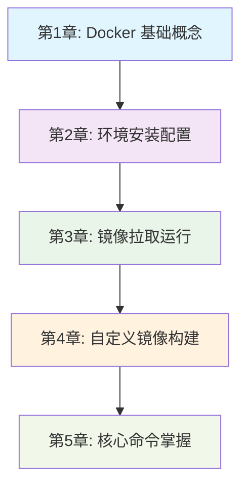
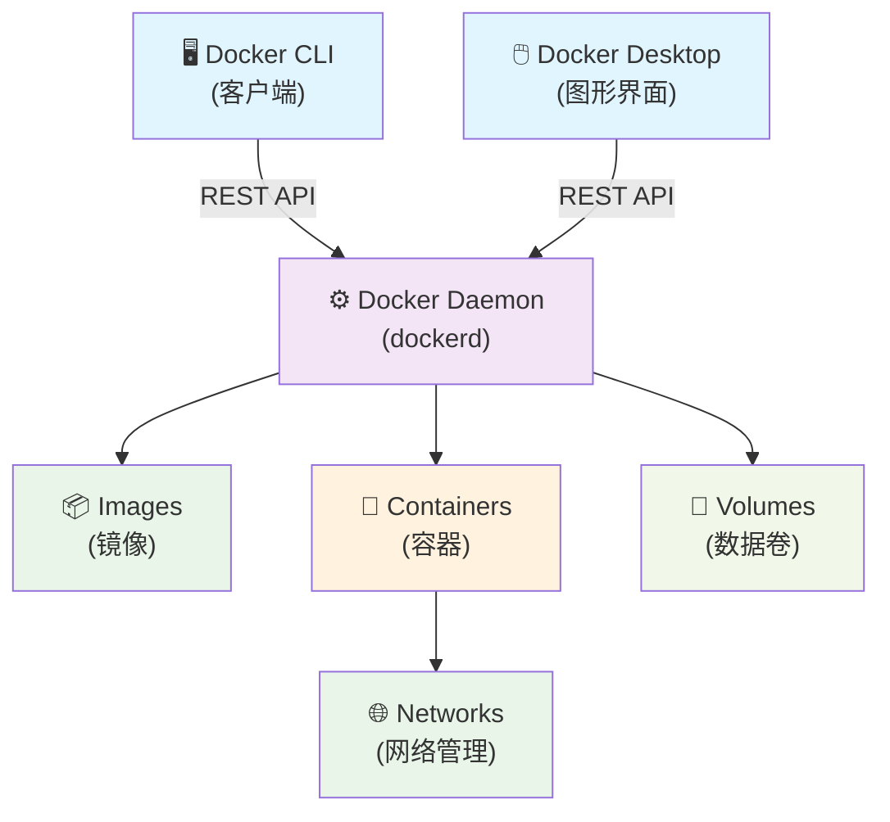

# Docker 动手教程

> 从零开始掌握 Docker 容器技术的完整实战指南

## 1. 教程概述

本教程将带您从 Docker 基础概念开始，逐步掌握容器技术的核心技能。通过理论学习与实践操作相结合的方式，帮助您快速成为 Docker 技术专家。

### 1.1 学习目标

- ✅ 深入理解 Docker 核心概念和架构
- ✅ 熟练掌握 Docker 环境安装和配置
- ✅ 学会镜像拉取、运行和管理
- ✅ 掌握自定义镜像构建和发布
- ✅ 精通 Docker 常用命令和最佳实践
- ✅ 具备容器化应用的开发和部署能力

### 1.2 学习路径



### 1.3 预计学习时间

- **总学习时间**：6-8 小时
- **理论学习**：2-3 小时
- **实践操作**：4-5 小时
- **建议学习周期**：1-2 周

---

## 2. Docker 基础概念

> 📂 详细内容：[01-Docker-Introduction](./01-Docker-Introduction/)

### 2.1 核心学习点

#### 2.1.1 传统基础设施的挑战

- **环境一致性问题**："在我机器上能运行"综合症
- **资源利用率低**：虚拟机开销大，硬件资源浪费
- **部署扩展困难**：手动配置复杂，扩展性差

#### 2.1.2 Docker 技术优势

| 特性 | 传统虚拟机 | Docker 容器 |
|------|------------|-------------|
| 启动时间 | 分钟级 | 秒级 |
| 资源消耗 | 高（完整OS） | 低（共享内核） |
| 隔离级别 | 硬件级隔离 | 进程级隔离 |
| 可移植性 | 差 | 优秀 |
| 管理复杂度 | 高 | 低 |

#### 2.1.3 Docker 架构组件



#### 2.1.4 核心概念理解

- **Docker Images (镜像)**：只读模板，采用分层存储
- **Docker Containers (容器)**：镜像的运行实例
- **Docker Registry (仓库)**：镜像存储和分发中心
- **Dockerfile**：构建镜像的指令文件

### 2.2 💡 实践建议

1. **理解容器 vs 虚拟机**：重点掌握两者的区别和适用场景
2. **熟悉架构组件**：了解各组件的职责和交互方式
3. **掌握核心术语**：为后续学习打好基础

---

## 3. 环境安装配置

> 📂 详细内容：[02-Docker-Installation](./02-Docker-Installation/)

### 3.1 🎯 核心学习点

#### 3.1.1 系统要求检查

**macOS 要求：**

- macOS 11.0+ (Big Sur 或更高版本)
- 4GB+ RAM (推荐 8GB+)
- 4GB+ 磁盘空间

**Windows 要求：**

- Windows 10 64-bit Pro/Enterprise/Education (版本 1903+) 或 Windows 11
- 启用 Hyper-V 和 WSL 2
- 4GB+ RAM (推荐 8GB+)

**Linux 要求：**

- 内核版本 3.10+ (推荐 4.0+)
- 支持 overlay2 存储驱动
- 64位架构 (x86_64/amd64)

#### 3.1.2 快速安装指南

**macOS 安装（推荐）：**

```bash
# 方法1: 官方安装包
# 下载 Docker Desktop for Mac
# 拖拽到 Applications 文件夹

# 方法2: Homebrew
brew install --cask docker
```

**Ubuntu/Debian 安装：**

```bash
# 添加 Docker 官方仓库
curl -fsSL https://download.docker.com/linux/ubuntu/gpg | sudo gpg --dearmor -o /etc/apt/keyrings/docker.gpg

# 安装 Docker Engine
sudo apt-get update
sudo apt-get install docker-ce docker-ce-cli containerd.io docker-compose-plugin

# 启动服务
sudo systemctl start docker
sudo systemctl enable docker

# 添加用户到 docker 组
sudo usermod -aG docker $USER
```

#### 3.1.3 安装验证

```bash
# 检查版本
docker --version
docker-compose --version

# 运行测试容器
docker run hello-world

# 查看系统信息
docker info
```

### 3.2 💡 实践建议

1. **选择合适的安装方式**：Docker Desktop 适合开发，Docker Engine 适合服务器
2. **配置镜像加速器**：提升国内用户的镜像拉取速度
3. **验证安装成功**：确保所有组件正常工作

---

## 4. 镜像拉取运行

> 📂 详细内容：[03-Pull-from-DockerHub-and-Run-Docker-Images](./03-Pull-from-DockerHub-and-Run-Docker-Images/)

### 4.1 🎯 核心学习点

#### 4.1.1 Docker Hub 基础

**镜像命名规范：**

```text
[registry]/[namespace]/[repository]:[tag]

示例：
- nginx:latest                    # 官方镜像
- mysql:8.0                       # 官方镜像带版本
- stacksimplify/app:1.0.0         # 用户镜像
```

#### 4.1.2 镜像操作实践

**搜索和拉取镜像：**

```bash
# 搜索镜像
docker search nginx
docker search --limit 5 mysql

# 拉取镜像
docker pull nginx:latest
docker pull mysql:8.0
docker pull ubuntu:20.04

# 查看本地镜像
docker images
docker images --format "table {{.Repository}}\t{{.Tag}}\t{{.Size}}"
```

#### 4.1.3 容器运行管理

**基础运行命令：**

```bash
# 运行容器
docker run nginx
docker run -d nginx                    # 后台运行
docker run -d -p 8080:80 nginx         # 端口映射
docker run -d -p 8080:80 --name web nginx  # 指定名称

# 交互式运行
docker run -it ubuntu:20.04 /bin/bash
docker run -it --rm alpine:latest sh   # 退出后自动删除
```

**容器生命周期管理：**

```bash
# 查看容器
docker ps                    # 运行中的容器
docker ps -a                 # 所有容器

# 容器控制
docker stop container_name   # 停止容器
docker start container_name  # 启动容器
docker restart container_name # 重启容器

# 容器清理
docker rm container_name     # 删除容器
docker rm -f container_name  # 强制删除
docker container prune       # 清理停止的容器
```

#### 4.1.4 容器交互调试

```bash
# 进入容器
docker exec -it container_name /bin/bash
docker exec -it container_name /bin/sh

# 查看容器日志
docker logs container_name
docker logs -f container_name    # 实时查看
docker logs --tail 50 container_name  # 查看最后50行

# 文件传输
docker cp file.txt container_name:/path/
docker cp container_name:/path/file.txt ./
```

### 4.2 💡 实践建议

1. **熟练掌握基础命令**：run, ps, stop, start, rm
2. **理解端口映射**：-p 参数的使用方法
3. **掌握容器调试**：exec, logs 命令的使用

---

## 5. 自定义镜像构建

> 📂 详细内容：[04-Build-new-Docker-Image-and-Run-and-Push-to-DockerHub](./04-Build-new-Docker-Image-and-Run-and-Push-to-DockerHub/)

### 5.1 🎯 核心学习点

#### 5.1.1 Dockerfile 基础

**常用指令说明：**

```dockerfile
# 基础镜像
FROM nginx:alpine

# 维护者信息
LABEL maintainer="your-email@example.com"

# 工作目录
WORKDIR /usr/share/nginx/html

# 复制文件
COPY index.html .
COPY ./static ./static

# 添加文件（支持URL和压缩包）
ADD app.tar.gz /app/

# 运行命令
RUN apk add --no-cache curl

# 环境变量
ENV NODE_ENV=production
ENV PORT=3000

# 暴露端口
EXPOSE 80 443

# 数据卷
VOLUME ["/data"]

# 启动命令
CMD ["nginx", "-g", "daemon off;"]
```

#### 5.1.2 实战：构建 Web 应用镜像

**1. 创建项目结构：**

```bash
mkdir my-web-app && cd my-web-app
```

**2. 创建自定义网页：**

```html
<!-- index.html -->
<!DOCTYPE html>
<html>
<head>
    <title>我的 Docker Web 应用</title>
    <style>
        body { font-family: Arial; text-align: center; margin-top: 50px; }
        .container { max-width: 600px; margin: 0 auto; }
        .highlight { color: #0066cc; }
    </style>
</head>
<body>
    <div class="container">
        <h1>🐳 欢迎使用 Docker!</h1>
        <p>这是我的第一个 <span class="highlight">自定义 Docker 镜像</span></p>
        <p>构建时间: <span id="buildTime"></span></p>
    </div>
    <script>
        document.getElementById('buildTime').textContent = new Date().toLocaleString();
    </script>
</body>
</html>
```

**3. 编写 Dockerfile：**

```dockerfile
# 使用官方 Nginx 镜像作为基础
FROM nginx:alpine

# 添加维护者信息
LABEL maintainer="your-name@example.com"
LABEL description="My first custom Docker image"

# 复制自定义网页到 Nginx 默认目录
COPY index.html /usr/share/nginx/html/

# 暴露 80 端口
EXPOSE 80

# 启动 Nginx
CMD ["nginx", "-g", "daemon off;"]
```

#### 5.1.3 镜像构建和测试

```bash
# 构建镜像
docker build -t my-web-app:v1.0 .

# 查看构建的镜像
docker images my-web-app

# 运行容器测试
docker run -d -p 8080:80 --name my-app my-web-app:v1.0

# 测试访问
curl http://localhost:8080
# 或浏览器访问 http://localhost:8080

# 查看容器状态
docker ps
docker logs my-app
```

#### 5.1.4 镜像发布到 Docker Hub

```bash
# 登录 Docker Hub
docker login

# 为镜像添加标签（替换 your-username）
docker tag my-web-app:v1.0 your-username/my-web-app:v1.0
docker tag my-web-app:v1.0 your-username/my-web-app:latest

# 推送镜像
docker push your-username/my-web-app:v1.0
docker push your-username/my-web-app:latest

# 验证发布成功
# 访问 https://hub.docker.com/r/your-username/my-web-app
```

#### 5.1.5 镜像优化技巧

**多阶段构建示例：**

```dockerfile
# 构建阶段
FROM node:16-alpine AS builder
WORKDIR /app
COPY package*.json ./
RUN npm ci --only=production

# 运行阶段
FROM nginx:alpine
COPY --from=builder /app/dist /usr/share/nginx/html
EXPOSE 80
CMD ["nginx", "-g", "daemon off;"]
```

### 5.2 💡 实践建议

1. **掌握 Dockerfile 语法**：重点理解 FROM, COPY, RUN, CMD 指令
2. **优化镜像大小**：使用 alpine 基础镜像，清理缓存文件
3. **版本管理策略**：合理使用标签进行版本控制

---

## 6. 核心命令掌握

> 📂 详细内容：[05-Essential-Docker-Commands](./05-Essential-Docker-Commands/)

### 6.1 🎯 核心学习点

#### 6.1.1 容器管理命令

**基础操作：**

```bash
# 容器查看
docker ps                    # 运行中的容器
docker ps -a                 # 所有容器
docker ps -q                 # 仅显示容器ID

# 容器控制
docker stop container_id     # 优雅停止
docker kill container_id     # 强制停止
docker start container_id    # 启动容器
docker restart container_id  # 重启容器
docker pause container_id    # 暂停容器
docker unpause container_id  # 恢复容器

# 容器清理
docker rm container_id       # 删除容器
docker rm -f container_id    # 强制删除
docker container prune       # 清理停止的容器
```

**容器交互：**

```bash
# 进入容器
docker exec -it container_name /bin/bash
docker exec -it container_name /bin/sh

# 执行命令
docker exec container_name ls -la
docker exec container_name cat /etc/hosts

# 文件传输
docker cp ./file.txt container_name:/path/
docker cp container_name:/path/file.txt ./

# 查看日志
docker logs container_name
docker logs -f container_name        # 实时查看
docker logs --tail 100 container_name # 最后100行
```

#### 6.1.2 镜像管理命令

```bash
# 镜像查看
docker images                # 所有镜像
docker images -q             # 仅显示镜像ID
docker images --format "table {{.Repository}}\t{{.Tag}}\t{{.Size}}"

# 镜像操作
docker pull image_name:tag   # 拉取镜像
docker push image_name:tag   # 推送镜像
docker rmi image_id          # 删除镜像
docker rmi -f image_id       # 强制删除

# 镜像构建
docker build -t image_name:tag .
docker build --no-cache -t image_name:tag .
docker tag source_image target_image

# 镜像清理
docker image prune           # 删除悬空镜像
docker image prune -a        # 删除未使用镜像
```

#### 6.1.3 系统管理命令

```bash
# 系统信息
docker info                  # 系统详细信息
docker version               # 版本信息
docker system df             # 磁盘使用情况

# 系统清理
docker system prune          # 清理未使用资源
docker system prune -a       # 深度清理
docker system prune --volumes # 包括数据卷清理

# 资源监控
docker stats                 # 实时资源使用
docker stats container_name  # 特定容器资源使用
docker top container_name    # 容器进程信息
```

#### 6.1.4 网络和存储命令

**网络管理：**

```bash
# 网络操作
docker network ls            # 列出网络
docker network create mynet  # 创建网络
docker network inspect bridge # 查看网络详情
docker network connect mynet container_name # 连接网络
docker network disconnect mynet container_name # 断开网络
```

**数据卷管理：**

```bash
# 数据卷操作
docker volume ls             # 列出数据卷
docker volume create myvolume # 创建数据卷
docker volume inspect myvolume # 查看数据卷详情
docker volume rm myvolume    # 删除数据卷
docker volume prune          # 清理未使用数据卷
```

#### 6.1.5 实用技巧和最佳实践

**批量操作：**

```bash
# 停止所有容器
docker stop $(docker ps -q)

# 删除所有停止的容器
docker rm $(docker ps -aq)

# 删除所有镜像
docker rmi $(docker images -q)

# 一键清理系统
docker system prune -a --volumes
```

**容器运行技巧：**

```bash
# 环境变量
docker run -e NODE_ENV=production app:latest
docker run --env-file .env app:latest

# 数据卷挂载
docker run -v /host/path:/container/path app:latest
docker run -v myvolume:/data app:latest

# 网络配置
docker run --network mynet app:latest
docker run -p 8080:80 app:latest

# 资源限制
docker run -m 512m --cpus="1.5" app:latest
```

### 6.2 💡 实践建议

1. **熟练掌握基础命令**：ps, run, stop, rm, images, rmi
2. **学会批量操作**：提高工作效率
3. **掌握调试技巧**：logs, exec, inspect 命令的使用
4. **定期清理资源**：避免磁盘空间不足

---

## 7. 学习资源

### 7.1 📚 官方文档

- [Docker 官方文档](https://docs.docker.com/)
- [Docker Hub](https://hub.docker.com/)
- [Dockerfile 参考](https://docs.docker.com/engine/reference/builder/)
- [Docker Compose 文档](https://docs.docker.com/compose/)

### 7.2 🎯 实践项目建议

1. **Web 应用容器化**：将现有 Web 应用打包成 Docker 镜像
2. **微服务架构**：使用 Docker Compose 部署多服务应用
3. **CI/CD 集成**：在持续集成流程中使用 Docker
4. **开发环境标准化**：为团队创建统一的开发环境

### 7.3 🛠️ 推荐工具

- **Docker Desktop**：图形化管理界面
- **Portainer**：Web 端容器管理
- **Docker Compose**：多容器应用编排
- **Watchtower**：自动更新容器镜像

---

## 8. 常见问题

### 8.1 ❓ 安装相关

**Q: Docker Desktop 启动失败怎么办？**
A: 检查系统要求，确保启用虚拟化功能，重启 Docker 服务。

**Q: 镜像拉取速度慢怎么办？**
A: 配置国内镜像加速器，如阿里云、腾讯云等。

### 8.2 ❓ 使用相关

**Q: 容器无法访问怎么办？**
A: 检查端口映射配置，确保防火墙设置正确。

**Q: 磁盘空间不足怎么办？**
A: 定期清理未使用的镜像、容器和数据卷。

**Q: 容器内时间不正确怎么办？**
A: 挂载主机时区文件：`-v /etc/localtime:/etc/localtime:ro`

### 8.3 ❓ 性能优化

**Q: 如何减小镜像大小？**
A: 使用 alpine 基础镜像，多阶段构建，清理缓存文件。

**Q: 如何提高容器启动速度？**
A: 优化 Dockerfile，减少层数，使用镜像缓存。

---

## 9. 🎯 总结

通过本教程的学习，您已经掌握了：

- ✅ **Docker 核心概念**：理解容器技术的本质和优势
- ✅ **环境搭建能力**：能够在不同平台安装配置 Docker
- ✅ **镜像管理技能**：熟练进行镜像拉取、运行和管理
- ✅ **自定义构建能力**：能够编写 Dockerfile 构建自定义镜像
- ✅ **命令行操作技能**：掌握 Docker 常用命令和最佳实践

### 9.1 🚀 下一步学习建议

1. **深入学习 Docker Compose**：掌握多容器应用编排
2. **学习 Kubernetes**：容器编排和集群管理
3. **实践 DevOps**：将 Docker 集成到 CI/CD 流程
4. **探索云原生**：学习微服务、服务网格等技术

### 9.2 📞 获取帮助

- 🌐 [Docker 官方社区](https://forums.docker.com/)
- 📚 [Stack Overflow](https://stackoverflow.com/questions/tagged/docker)
- 💬 [Docker 中文社区](https://www.docker.org.cn/)

---
