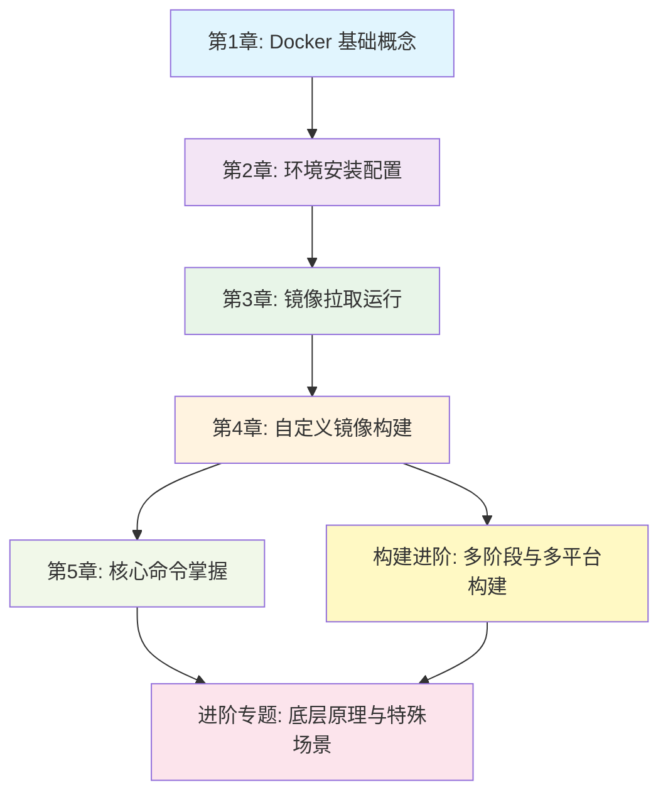

# Docker 动手教程

> 从零开始掌握 Docker 容器技术的完整实战指南

## 1. 教程概述

本教程将带您从 Docker 基础概念开始，逐步掌握容器技术的核心技能。通过理论学习与实践操作相结合的方式，帮助您快速成为 Docker 技术专家。

### 1.1 学习目标

- ✅ 深入理解 Docker 核心概念和架构
- ✅ 熟练掌握 Docker 环境安装和配置
- ✅ 学会镜像拉取、运行和管理
- ✅ 掌握自定义镜像构建和发布
- ✅ 精通 Docker 常用命令和最佳实践
- ✅ 掌握多阶段构建与多平台镜像构建技术
- ✅ 理解容器底层原理（OCI 规范、源码执行流程、联合文件系统）

### 1.2 学习路径

```mermaid
flowchart TD
    A[第1章: Docker 基础概念] --> B[第2章: 环境安装配置]
    B --> C[第3章: 镜像拉取运行]
    C --> D[第4章: 自定义镜像构建]
    D --> E[第5章: 核心命令掌握]
    D --> F[构建进阶: 多阶段与多平台构建]
    E --> G[进阶专题: 底层原理与特殊场景]
    F --> G

    style A fill:#e1f5fe
    style B fill:#f3e5f5
    style C fill:#e8f5e8
    style D fill:#fff3e0
    style E fill:#f1f8e9
    style F fill:#fff9c4
    style G fill:#fce4ec
```

### 1.3 预计学习时间

- **基础部分**：6-8 小时（理论 2-3 小时 + 实践 4-5 小时）
- **进阶部分**：构建进阶 + 进阶专题约 4-6 小时
- **建议学习周期**：2-3 周

---

## 2. 章节目录

| 章节               | 核心内容                                             | 详情                                                                 |
| ------------------ | ---------------------------------------------------- | -------------------------------------------------------------------- |
| 01 Docker 基础概念 | 传统基础设施挑战、Docker 架构与核心组件              | [README](./01-Docker-Introduction/)                                  |
| 02 环境安装配置    | macOS / Windows / Linux 三平台安装与验证             | [README](./02-Docker-Installation/)                                  |
| 03 镜像拉取与运行  | Docker Hub、镜像拉取、容器生命周期管理               | [README](./03-Pull-from-DockerHub-and-Run-Docker-Images/)            |
| 04 自定义镜像构建  | Dockerfile 编写、镜像构建与推送到 Docker Hub         | [README](./04-Build-new-Docker-Image-and-Run-and-Push-to-DockerHub/) |
| 04-2 多阶段构建    | golang → scratch，实测 1.27GB → 3.41MB，heredoc 语法 | [README](./04-2-Multi-Stage-Builds/)                                 |
| 04-3 多平台构建    | buildx 多平台构建、xx 交叉编译                       | [README](./04-3-Multi-Platform-Builds/)                              |
| 05 核心命令掌握    | 命令大全与配套学习脚本                               | [README](./05-Essential-Docker-Commands/)                            |

### 2.1 进阶专题

掌握基础操作后，通过以下专题深入 Docker 底层原理与特殊场景：

| 专题                      | 核心内容                                         | 详情                                                             |
| ------------------------- | ------------------------------------------------ | ---------------------------------------------------------------- |
| 容器 OCI 规范介绍         | runtime-spec 与 image-spec、runc 运行时          | [阅读](./Advanced-Topics/OCI%20介绍/OCI%20介绍.md)               |
| Docker 源码分析           | `docker run` 命令完整执行流程                    | [阅读](./Advanced-Topics/Docker%20源码分析/Docker%20源码分析.md) |
| 联合文件系统              | OverlayFS 原理与实验、存储驱动                   | [阅读](./Advanced-Topics/联合文件系统/Union%20Filesystem.md)     |
| containerd OverlayFS 简介 | containerd 挂载信息与目录结构                    | [阅读](./Advanced-Topics/containerd-overlayfs-intro.md)          |
| 在 Docker 中运行 GUI 程序 | X11/Wayland、WSLg、XQuartz、VNC 无头方案（实测） | [阅读](./Advanced-Topics/GUI/docker_gui.md)                      |

---

## 3. 常见问题

### 3.1 ❓ 安装相关

**Q: Docker Desktop 启动失败怎么办？**
A: 检查系统要求，确保启用虚拟化功能，重启 Docker 服务。

**Q: 镜像拉取速度慢怎么办？**
A: 配置国内镜像加速器，如阿里云、腾讯云等。

### 3.2 ❓ 使用相关

**Q: 容器无法访问怎么办？**
A: 检查端口映射配置，确保防火墙设置正确。

**Q: 磁盘空间不足怎么办？**
A: 定期清理未使用的镜像、容器和数据卷。

**Q: 容器内时间不正确怎么办？**
A: 挂载主机时区文件：`-v /etc/localtime:/etc/localtime:ro`

### 3.3 ❓ 性能优化

**Q: 如何减小镜像大小？**
A: 使用 alpine 基础镜像、多阶段构建、清理缓存文件。

**Q: 如何提高容器启动速度？**
A: 优化 Dockerfile、减少层数、使用镜像缓存。

---

## 4. 总结与下一步

### 4.1 📖 学习资源

**官方文档：**

- [Docker 官方文档](https://docs.docker.com/)
- [Docker Hub](https://hub.docker.com/)
- [Dockerfile 参考](https://docs.docker.com/reference/dockerfile/)

**推荐工具：**

- [Docker Desktop](https://www.docker.com/products/docker-desktop/)：图形化管理界面，适用于开发环境
- [Colima](https://github.com/abiosoft/colima)：macOS/Linux 轻量容器运行时（本教程实测环境）
- [Portainer](https://www.portainer.io/)：Web 端容器管理界面
- [Docker Buildx](https://github.com/docker/buildx)：官方构建插件，支持多平台构建（04-3 章）
- [Dive](https://github.com/wagoodman/dive)：镜像层分析工具
- [Trivy](https://github.com/aquasecurity/trivy)：镜像与容器安全扫描

### 4.2 🚀 下一步学习建议

完成本教程后，推荐继续学习同系列教程：

- 🐳 [**Kubernetes 动手教程**](https://github.com/ForceInjection/kubernetes-hands-on-course)：容器编排和集群管理
- ☁️ [**云原生开发**](https://github.com/ForceInjection/cloud-native-dev)：《使用云原生技术进行软件开发》课程课件，涵盖 Docker、Kubernetes、微服务与 CI/CD

### 4.3 📞 获取帮助

- 🌐 [Docker 官方社区](https://forums.docker.com/)
- 📚 [Stack Overflow](https://stackoverflow.com/questions/tagged/docker)
- 💬 [Docker 中文社区](https://www.docker.org.cn/)
